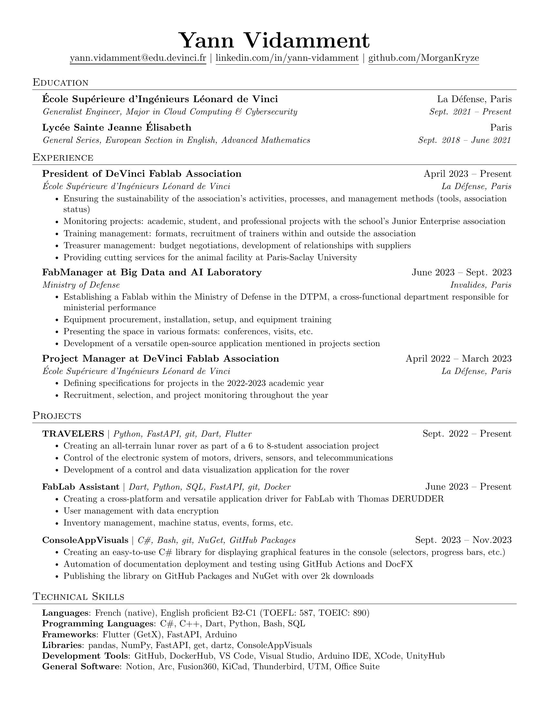
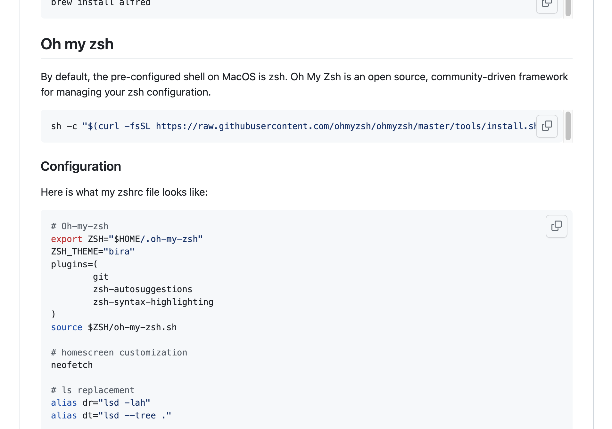
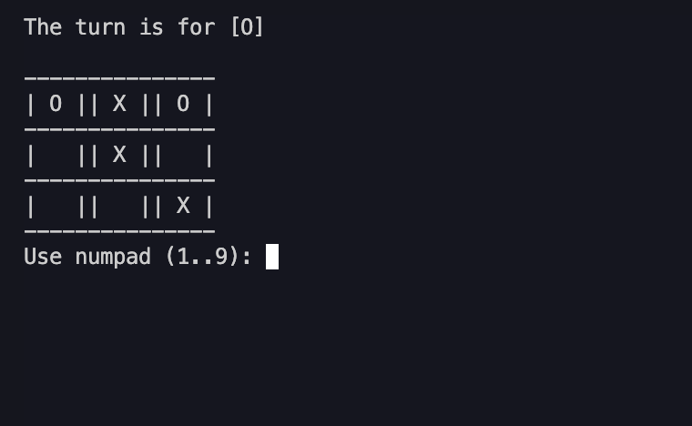
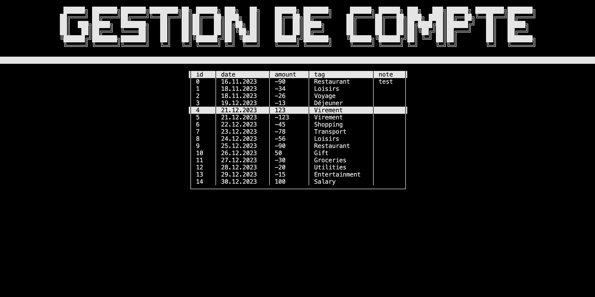
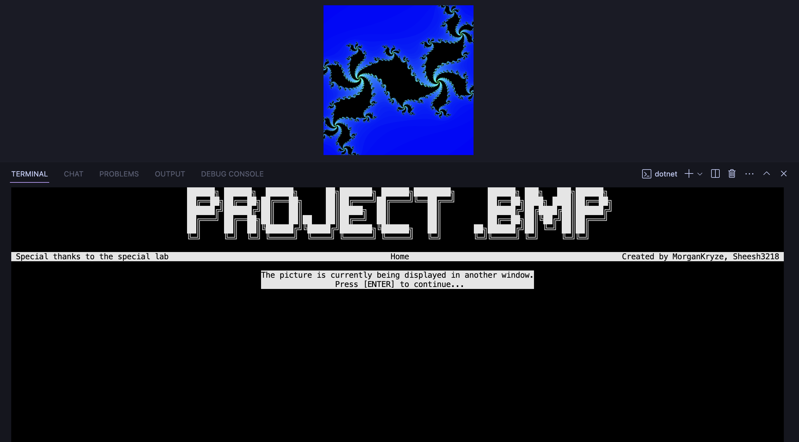
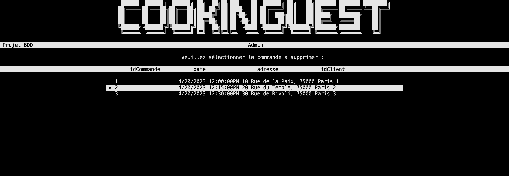
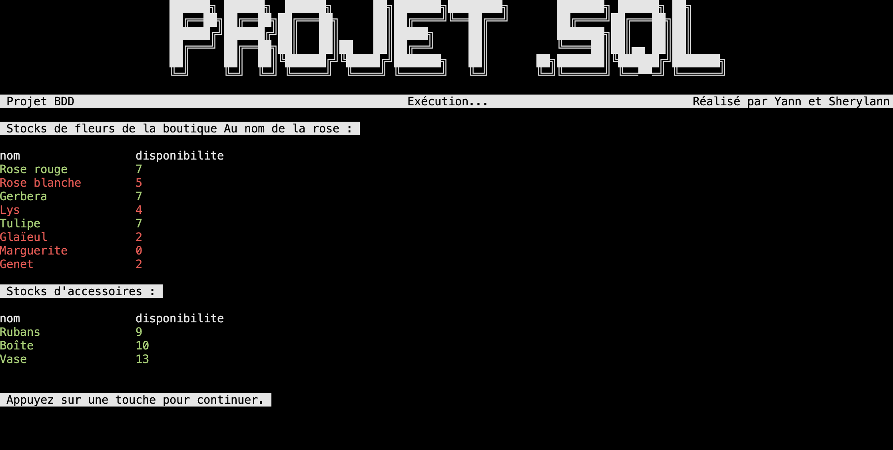
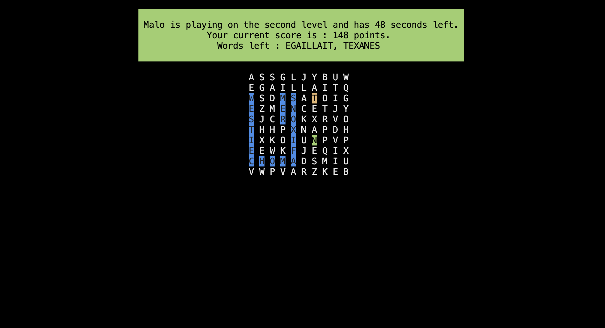
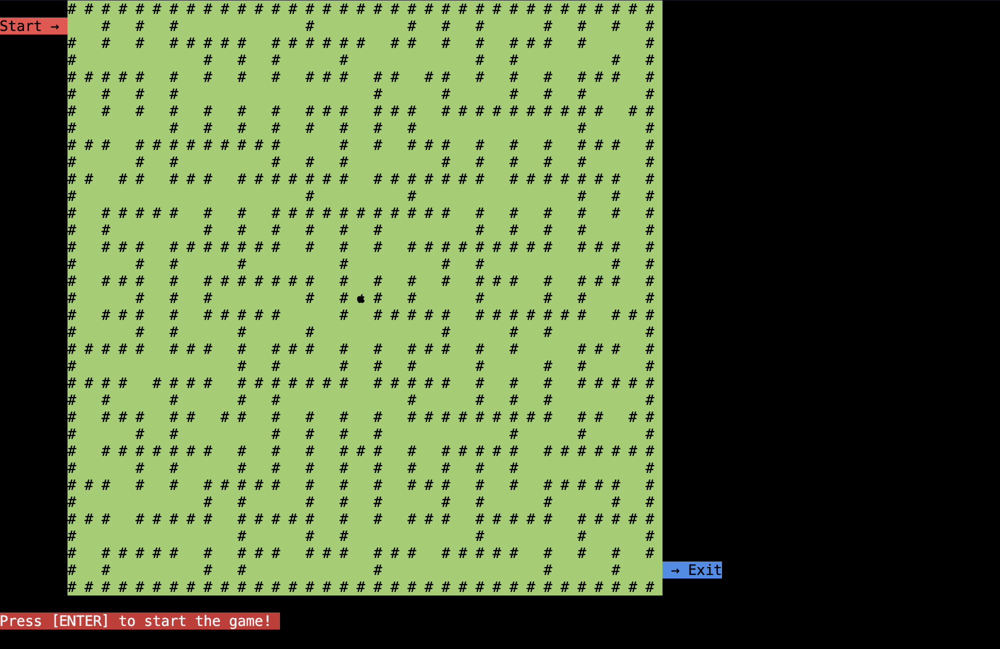

# Hey 👋, Welcome to my GitHub profile

  
## 💻 About me

Currently at an engineering school, I get to use VsCode, Docker or Flutter. But what I like most currently is C# and its potential.
Through my different projects, I try to go further and further into the language and discover its specifics.

However, I'm not solely focused on C#. I try my best to learn dart/Flutter and Python on the side to stay competitive!  
  
## 📊 Github Stats

<table>
    <tr>
        <td valign="top" width="50%">
            
        </td>
        <td valign="top" width="50%">
            
        </td>
    </tr>
</table>  

## 📬 Contact me

## 📁 Projects

### 🌄 ConsoleAppVisuals

This is my biggest project: a C# console app library that allows you to create a console app with a GUI. It's a work in progress and I'm trying to add new features as often as I can. The objective is to create both a useful and easy to use library for beginners and advanced developers.

### 📃 Resume template

This project is a fork of the [jakegut/resume](https://github.com/jakegut/resume) implementing a convert script and auto-publish to github-pages.

### 🖥️ Mac Setup

A quick guide for lambda people to setup their Mac and for developers. It provides a list of useful apps and a few tips to make your Mac experience better.

### 📝 TicTacToe MiniMax

This project is a fork of the [TicTacToe](https://github.com/Cledersonbc/tic-tac-toe-minimax) implementing the ability to play against a human.

### 💵 Banking Assistant

A small C# console app to manage incomes and expenses.

### 📺 Computer Science Problem

I built this project for my computer science class. The goal was to create a C# app that can create fractals, manipulate bitmap images (convolution, filters, ...) and switch languages (french and english). I also added a few other features like a custom color picker, a custom file explorer and a custom console.

### 🥣 CookingGuest

This is a school project where we had to create a sql database and a C# app to manage it. The goal was to create a database for recipes, ingredients and orders. You may also take the place of a customer and create an order.

### 🌹 FlowerStore

This is a school project where we had to create a sql database and a C# app to manage it. The goal was to create a database for a flower store that would allow you to manage the store's stock and orders. You may also take the place of a customer and create an order.

### 📃 WordScramble

This was a school project designed to learn the basics of C#. The goal was to create a console app that would allow you to play a word scramble game. The game would generate a random letter grid and give you words you had to find in it within a time limit.

### 📜 Labyrinth

This was also a school project where we had to create a labyrinth game in a C# console app. The goal was to create a game where you could move a character in a labyrinth and collect items. The labyrinth was generated randomly using a recursive algorithm.

### 🤖 Discord bot

This was a prototype of a Discord bot that I made with a friend to discover both python and Discord. It was supposed to be a bot that would allow you to play music in a voice channel using the youtube dl library.

    

  
