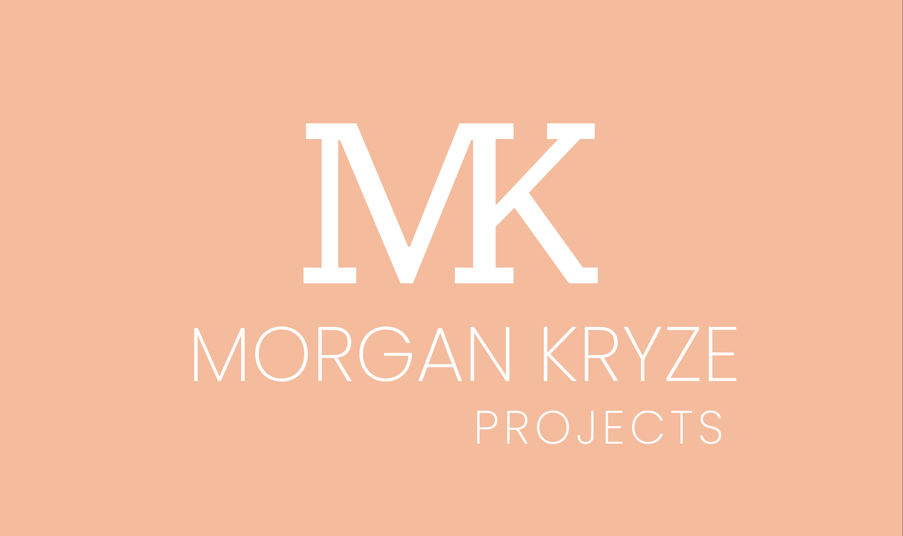

# Hey 👋, Welcome to my GitHub profile

## 📊 My GitHub stats

<a href="https://github.com/MorganKryze/github-stats">
<table>
  <tr>
    <td></td>
    <td></td>
  </tr>
</table>
</a>

    

## 📁 Projects

### 🌄 ConsoleAppVisuals

> This is my biggest project: a C# console app library that allows you to create a console app with a GUI. It's a work in progress and I'm trying to add new features as often as I can. The objective is to create both a useful and easy to use library for beginners and advanced developers.

### 🖥️ Portfolio

If you are curious enough to see my portfolio, you can check it out at [blog.libresoftware.cloud](https://blog.libresoftware.cloud).

Cheers! 🍻
